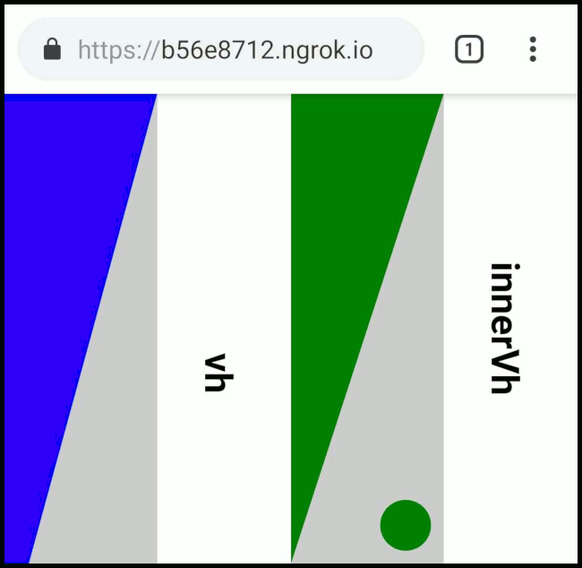

# Inner vh

Browser UI aware vh. Utility exposing JavaScript `innerHeight` to CSS.

[294 B](https://bundlephobia.com/result?p=inner-vh@0.0.13) minified and gzipped.

## Demo

Try [this](https://onset.github.io/inner-vh/) in Google Chrome/Firefox on Android.



## Installation

```bash
npm install inner-vh
```

## Usage

### Basic Example

#### JavaScript

```javascript
import innerVh from 'inner-vh'

innerVh()
```

#### CSS

```css
body {
	min-height: 100vh; // Fallback for very old browsers
	min-height: calc(var(--innerVh, 1vh) * 100);
}
```

---

---

### Advanced Example

#### JavaScript

```javascript
import innerVh from 'inner-vh'

innerVh(
	'rawInnerVh', // Custom property name
	(innerVhInPx) => console.log(`innerVh = ${innerVhInPx}px`), // On change callback
	document.documentElement // Element with custom property
)
```

#### CSS

```css
:root {
	--innerHeight: calc(var(--rawInnerVh, 1vh) * 100); /* Fallbacks to 100vh */
}

body {
	min-height: var(--innerHeight);
}
```
